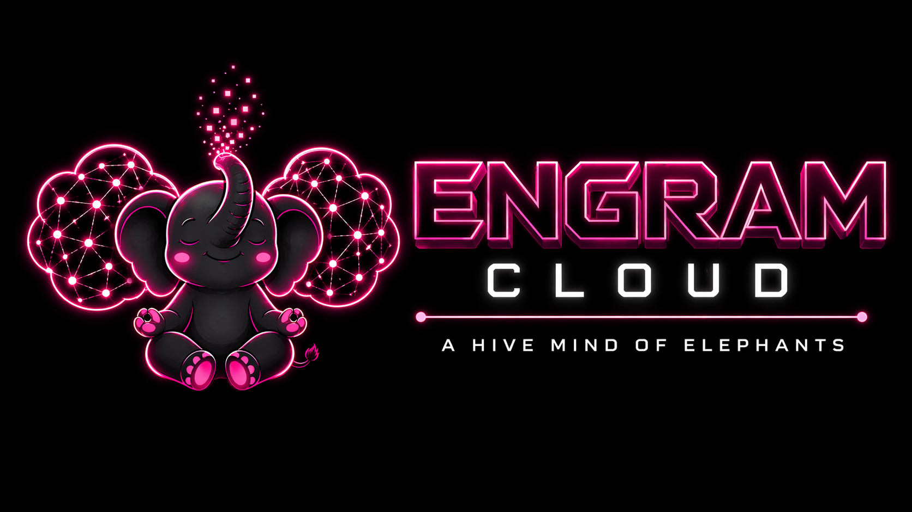

[← Back to Engram Cloud](ENGRAM-CLOUD.md)

# Engram Cloud Branding

This page defines the visual identity and asset usage for **Engram Cloud**.

Current asset set is stored under `assets/branding/` using the filenames listed below.

---

## Brand Positioning

Engram Cloud should feel:

- local-first
- futuristic
- self-hosted
- developer-grade
- reliable
- slightly playful, without losing technical credibility

The visual identity should support the idea of:

> a shared memory mesh that remains under the developer's control.

---

## Core Motif

The elephant remains the core identity anchor.

### Why the elephant works
- memory metaphor is immediate
- visually distinctive
- emotionally warm without becoming childish
- adaptable to both product and campaign surfaces

For Engram Cloud, the elephant is extended with:

- cloud/memory mesh geometry
- neon/future glow
- multi-device continuity motifs
- shared-memory / distributed-intelligence symbolism

---

## Recommended Asset Set

Place final assets here:

```text
assets/branding/
```

Recommended filenames:

```text
assets/branding/engram-cloud-logo.png
assets/branding/engram-cloud-elephant-network.png
assets/branding/engram-cloud-elephant.png
```

## Current Asset Preview

### Logo / Hero



### Elephant Network


### Elephant Mark / Light Variant


---

## Intended Asset Roles

### 1. `engram-cloud-logo.png`
Use as:
- hero image in cloud docs
- launch/social image
- video chapter/title card
- release visual

Recommended meaning:
- product identity
- launch branding
- "Engram Cloud" as a named surface

### 2. `engram-cloud-elephant-network.png`
Use as:
- deployment or architecture-adjacent visual
- multi-machine continuity visual
- cloud sync concept art

Recommended meaning:
- replication across devices
- memory mesh
- continuity between endpoints

### 3. `engram-cloud-elephant.png`
Use as:
- mascot/support image
- lighter docs sections
- side-panel/login/dashboard branding accents

Recommended meaning:
- brand warmth
- memory identity
- visual support without too much UI weight

---

## Visual Language

### Palette
Preferred mood:

- near-black backgrounds
- neon magenta / pink highlights
- cool violet accents
- white or near-white text
- occasional cyan/ice highlights for status and buttons

This should feel:

- premium
- technical
- slightly cyberpunk
- but still legible and professional

### Contrast
Maintain strong contrast for:

- headings
- active tabs
- buttons
- status surfaces

Avoid washed-out mid-gray text over dark backgrounds.

### Typography feel
Prefer:

- monospaced or semi-monospace accent typography for system labels
- large, bold, geometric display treatment for product name
- readable body copy for docs/dashboard text

---

## Usage Recommendations

### In `README.md`
Use the logo/hero asset near the Cloud section or link to the dedicated Cloud docs.

### In `docs/ENGRAM-CLOUD.md`
Recommended placement:

1. hero logo near top
2. elephant-network visual in architecture/deploy concept section
3. mascot image in branding or wrap-up sections

### In dashboard/login
Use the branding sparingly:

- top-left brand identity
- login side panel
- empty states

Do not overload every screen with large hero art.

---

## Do / Don't

### Do
- keep dark theme coherent
- use the elephant as a recognizable anchor
- preserve the memory/cloud symbolism
- use the network/cloud motif to reinforce continuity and replication
- keep visuals polished enough for launch screenshots/video

### Don't
- mix unrelated mascot styles
- use low-contrast pink-on-dark text for body copy
- let branding crowd out actual product information
- shift into a childish or cartoon-only tone
- overuse giant illustrations in dense operational screens

---

## Suggested Doc Integration

When the assets are added, use markdown like:

```md

```

or from root README:

```md

```

---

## Integrated Usage

These assets are now ready to be referenced from:

- `README.md`
- `docs/ENGRAM-CLOUD.md`
- launch/release docs
- video/client briefs
